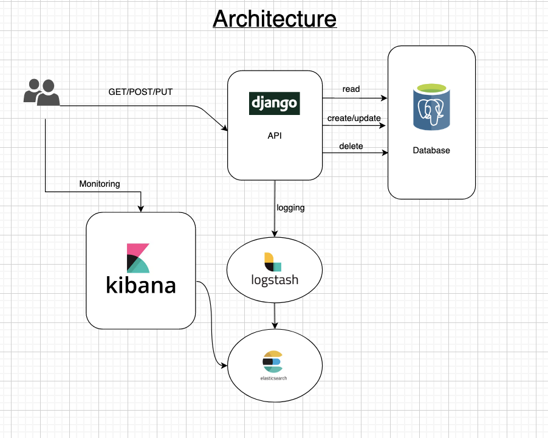
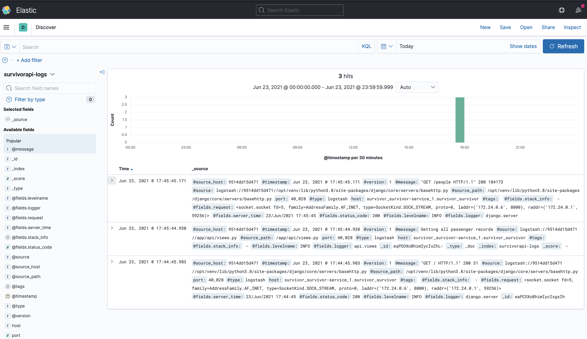

[](https://badge.fury.io/js/angular2-expandable-list)
[](https://www.gnu.org/software/bash/)

# SurvivorAPI

## Description
> Demo API Exercise

## Table of contents

- [Project Name](#SurvivorAPI)
  - [Description](#description)
  - [Table of contents](#table-of-contents)
  - [Prerequisites](#prerequisites)
  - [Architecture](#architecture)
  - [Deployment](#deployment)
    - [Monitoring](#monitoring)
    - [Seeding](#seeding)

  
## Prerequisites
This project requires the below dependencies

```text
Docker >=20.10.6
Docker-compose >= 1.29.1 or Kubernetes (GKE)
```
## Architecture



## Deployment

These instructions will get you a copy of the project up and running. 

**BEFORE YOU INSTALL:** please read the [prerequisites](#prerequisites)

Start with cloning this repo on your local machine:

```sh
~$ git clone https://gitlab.com/amotolani/API-Exercise.git
~$ cd API-Exercise/survivor
```

To deploy, run the deployment script in the project folder with the `deploy` option 

```sh
~$ ./deployment.sh deploy
```
Follow the prompt and specify your deployment choice.

```sh
Deployment Options.
Enter '1' to deploy using docker-compose
Enter '2' to deploy using kubernetes
Your Answer: 
```

Options 1.
Application will be deployed locally using docker compose.

Local URLs 

```
survivovapi   >>>  http://localhost:8000    
kibana        >>> http://localhost:5601  

```

Options 2.
Application will be deployed to your configured Kubernetes Cloud Cluster (GKE). Kindly ensure that `kubectl` is configured appropriately

Kubernetes URLs

To access the service, kindly use the Kubernetes Load balancer I.Ps

```
survivovapi   >>> http://{SurvivorApi-Load-Balanacer-I.P}:8000
kibana        >>> http://{Kibana-Load-Balanacer-I.P}:5601
```
See [Architecture](#architecture) for deployed services

### Monitoring

Set up the log streaming Dashboard

- Follow the instructions [here](https://www.elastic.co/guide/en/kibana/current/index-patterns.html) to create the logging index pattern
- Index Pattern `survivorapi-logs*`
- Open the Discover tab to view logs stream

)


### Seeding

Optionally, if you like to load the application database with some test data. You can run the below commands
```sh
~$ ./deployment.sh seed
```

Select the deployment you would like to load the data into

```sh
~$ Seeding Options.
Enter '1' to seed data into your docker-compose deployment
Enter '2' to seed data into your kubernetes deployment
Your Answer: 
```

